# Adaptive Instance Normalization (AdaIN) [](https://impasto-lab.github.io/AdaIN/assets/adain-pipeline.html)

This is a PyTorch reproduction of **Arbitrary Style Transfer in Real-time with Adaptive Instance Normalization** by Huang and Belongie (ICCV 2017).

The method transfers an arbitrary style in real time:

1. The VGG encoder extracts features at layer `relu4_1`.
2. AdaIN sets the channel-wise mean and variance of the content features to those of the style features.
3. A feed-forward decoder converts the adjusted features back into an image.

At test time, feature interpolation sets the balance between content and style. No retraining is necessary. Inference is feed-forward and deterministic, and it runs efficiently on a GPU.

## Examples

<table>
  <tr align="center">
    <th align="center" width="33.3%" style="text-align: center;"><div align="center">Style Reference</div></th>
    <th align="center" width="33.3%" style="text-align: center;"><div align="center">Content Image</div></th>
    <th align="center" width="33.3%" style="text-align: center;"><div align="center">Stylized</div></th>
  </tr>
  <tr align="center">
    <td>
      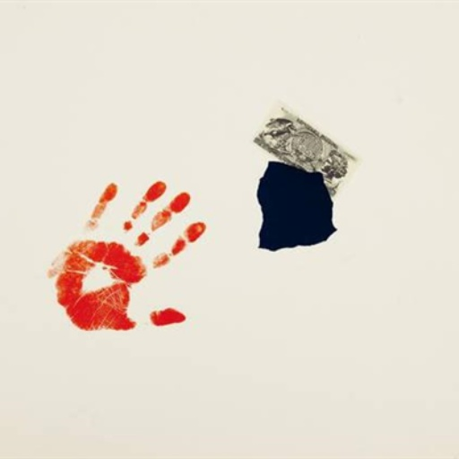<br>
      <sub><em>Impronte d'artista</em></sub>
    </td>
    <td>
      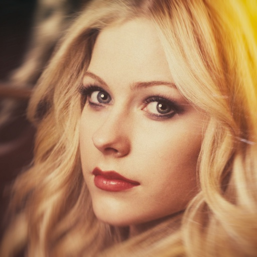<br>
      <sub><em>Avril</em></sub>
    </td>
    <td>
      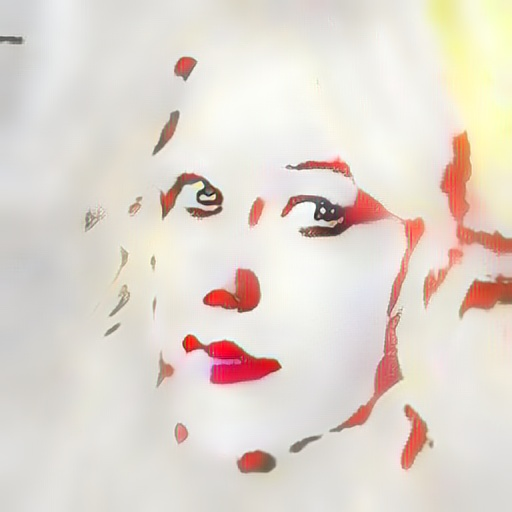<br>
      <sub>Avril &times; Impronte d'artista</sub>
    </td>
  </tr>
  <tr align="center">
    <td>
      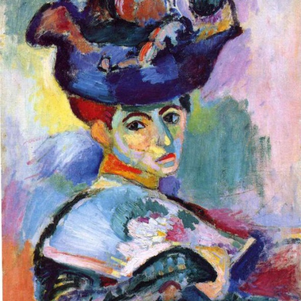<br>
      <sub><em>Woman with a Hat</em> (Matisse)</sub>
    </td>
    <td>
      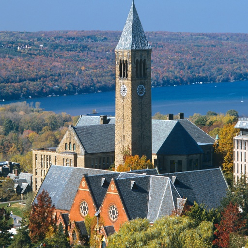<br>
      <sub><em>Cornell</em></sub>
    </td>
    <td>
      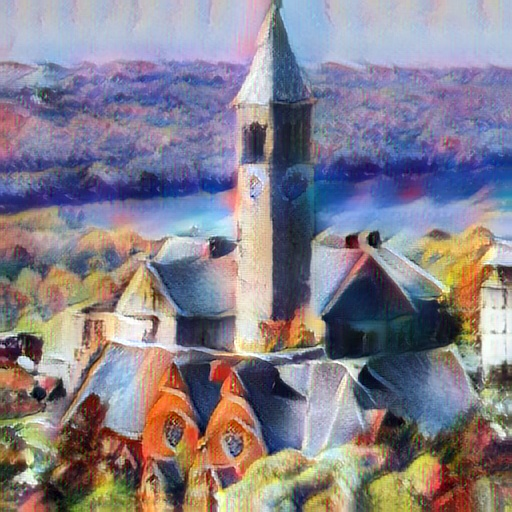<br>
      <sub>Cornell &times; Matisse</sub>
    </td>
  </tr>
  <tr align="center">
    <td>
      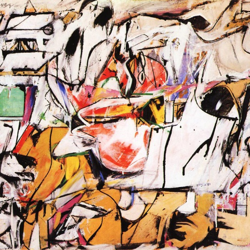<br>
      <sub><em>Asheville</em></sub>
    </td>
    <td>
      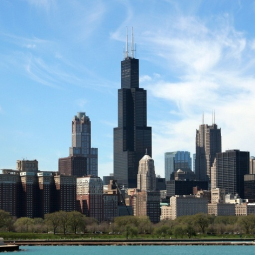<br>
      <sub><em>Chicago</em></sub>
    </td>
    <td>
      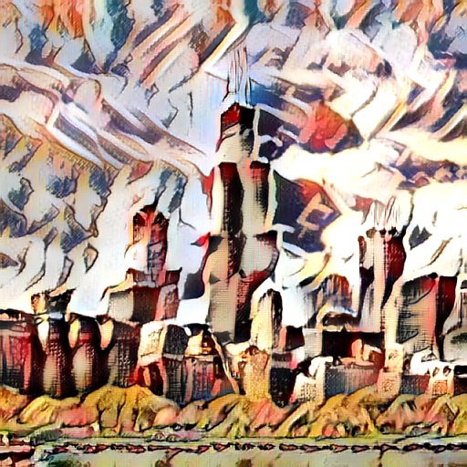<br>
      <sub>Chicago &times; Asheville</sub>
    </td>
  </tr>
  <tr align="center">
    <td>
      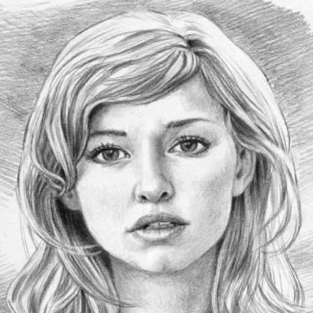<br>
      <sub><em>Sketch</em></sub>
    </td>
    <td>
      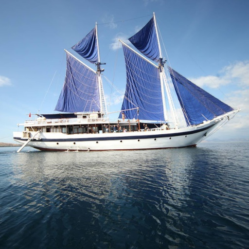<br>
      <sub><em>Sailboat</em></sub>
    </td>
    <td>
      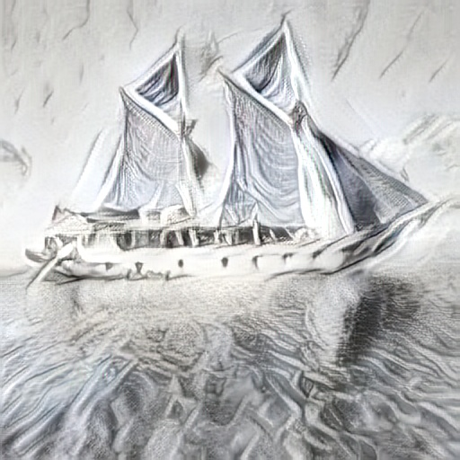<br>
      <sub>Sailboat &times; Sketch</sub>
    </td>
  </tr>
  <tr align="center">
    <td>
      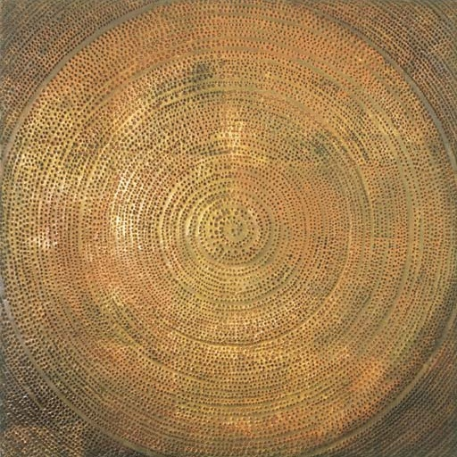<br>
      <sub><em>Goeritz</em></sub>
    </td>
    <td>
      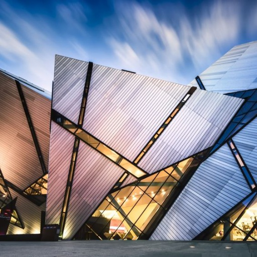<br>
      <sub><em>Modern Architecture</em></sub>
    </td>
    <td>
      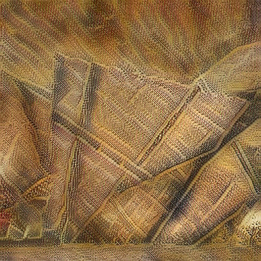<br>
      <sub>Modern &times; Goeritz</sub>
    </td>
  </tr>
  <tr align="center">
    <td>
      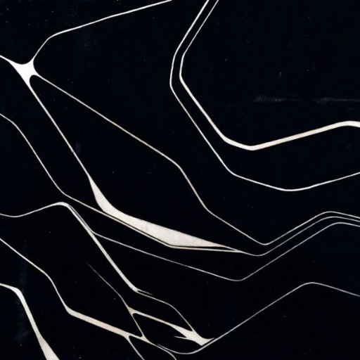<br>
      <sub><em>En Campo Gris</em></sub>
    </td>
    <td>
      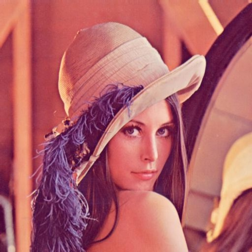<br>
      <sub><em>Lenna</em></sub>
    </td>
    <td>
      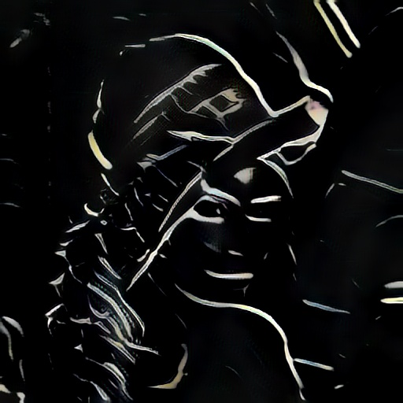<br>
      <sub>Lenna &times; En Campo Gris</sub>
    </td>
  </tr>
</table>

## Installation

1. Create and activate a Conda environment:

```bash
conda create -n adain python=3.12 -y
conda activate adain
```

2. Install PyTorch with the CUDA version that matches your system (see [pytorch.org](https://pytorch.org/get-started/locally/)).

3. Install the other dependencies:

```bash
pip install -r requirements.txt
```

## Usage

To stylize an image, give a content image and a style image to the command-line tool:

```bash
python stylize.py --content assets/content.jpg --style assets/style.jpg
```

Use `--alpha` to set the balance between content and style at test time (default: `1.0`). Any value in `[0, 1]` is valid:

<table>
  <tr align="center">
    <th align="center" width="20%" style="text-align: center;"><div align="center">Style Reference</div></th>
    <th align="center" width="20%" style="text-align: center;"><div align="center">Content Image</div></th>
    <th align="center" width="20%" style="text-align: center;"><div align="center">&alpha; = 0.3</div></th>
    <th align="center" width="20%" style="text-align: center;"><div align="center">&alpha; = 0.6</div></th>
    <th align="center" width="20%" style="text-align: center;"><div align="center">&alpha; = 1.0</div></th>
  </tr>
  <tr align="center">
    <td>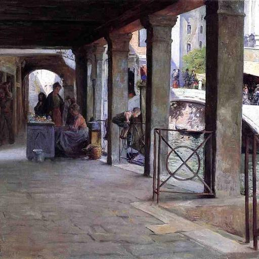</td>
    <td>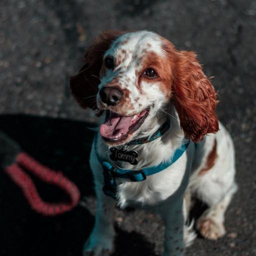</td>
    <td>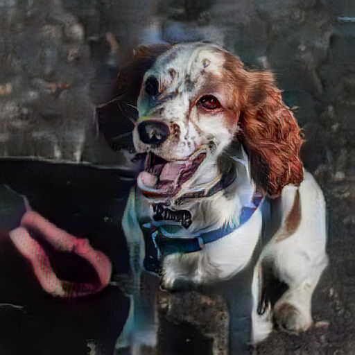</td>
    <td>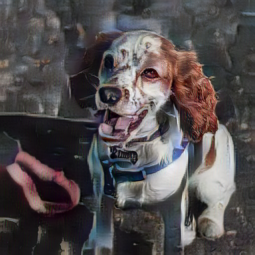</td>
    <td>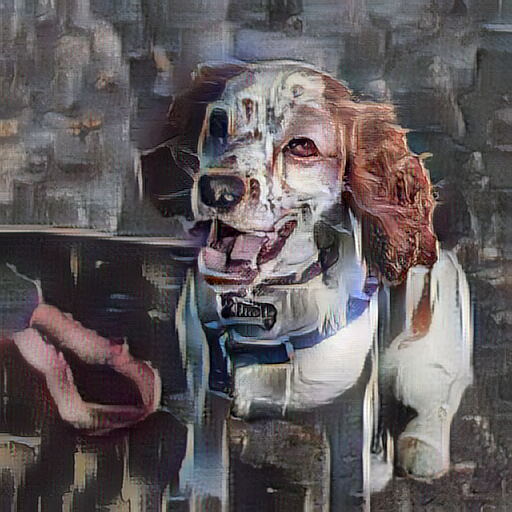</td>
  </tr>
</table>

- For natural results that keep the content structure, use `--alpha 0.5` to `0.7`.
- For strong artistic abstraction, increase `--alpha` up to `1.0`.

To keep the original resolution of the input image, use `--content-size 0`.

## Options

| Argument | Type | Default | Description |
|:---:|:---:|:---:|:---:|
| `--content` | path | required | Content image or directory of images. |
| `--style` | path | required | Style reference image or directory of images. |
| `--decoder` | path | `models/decoder.pth` | Path to the trained decoder `.pth` file or the training checkpoint `latest.pt`. |
| `--vgg` | path | `models/vgg_normalised.pth` | Path to the normalized VGG-19 encoder weights. |
| `--alpha` | float | `1.0` | Content-style interpolation factor in `[0, 1]`. Use `0.6` for a balanced, painterly result. |
| `--content-size` | integer | `512` | Short-side size of the content image in pixels. `0` keeps the original size. |
| `--style-size` | integer | `512` | Short-side size of the style image in pixels. `0` keeps the original size. |
| `--output-dir` | path | `outputs/stylized` | Directory for the stylized images. |
| `--device` | string | `auto` | Execution device: `auto`, `cuda`, `cpu`, or `mps`. |
| `-h`, `--help` | flag | - | Show the help message and exit. |

The default values reproduce the main inference setting of the paper (feature transfer at `relu4_1`).

## Training

Content images: [Unsplash Lite](https://github.com/unsplash/datasets). Style images: [ArtBench-10](https://github.com/liaopeiyuan/artbench).

To train the decoder from scratch, use unpaired content and style datasets:

```bash
# Train for 160,000 steps
python train.py --content-dir /path/to/content --style-dir /path/to/style

# Resume an interrupted training run (the checkpoint restores all settings)
python train.py --resume outputs/runs/adain/latest.pt
```

When you resume training, you can change only the run-time settings: `--max-steps`, `--output-dir`, `--device`, `--num-workers`, and the logging and saving intervals.

The main training parameters are in `configs/train.json`. You can override them from the command line:

| Parameter | Type | Default | Description |
|:---:|:---:|:---:|:---:|
| `--batch-size` | integer | `16` | Number of unpaired content-style pairs in each batch. |
| `--max-steps` | integer | `160000` | Total number of training iterations (same as the paper). |
| `--learning-rate` | float | `1e-4` | Initial learning rate of the Adam optimizer. It decays with inverse time decay (decay rate: `5e-5`). |
| `--style-weight` | float | `10.0` | Weight of the style loss $\mathcal{L}_s$ relative to the content loss $\mathcal{L}_c$. |
| `--resize-size` | integer | `512` | Short-side size in pixels before the random crop. |
| `--crop-size` | integer | `256` | Side length in pixels of the square training crop. |
| `--resume` | path | `None` | Path to the `latest.pt` checkpoint from which to resume training. |

## Project Structure

```text
.
|-- assets/
|   |-- examples/               # Benchmark style transfer examples from the ICCV 2017 paper
|   |-- readme/                 # Result images for this README
|   |-- adain-pipeline.html     # Interactive pipeline animation (GitHub Pages)
|   |-- content.jpg             # Example input content image
|   `-- style.jpg               # Example input style image
|-- configs/
|   `-- train.json              # Training configuration and hyperparameters
|-- models/
|   |-- adain.py                # Adaptive Instance Normalization layer
|   |-- decoder.py              # Decoder network (mirror of the VGG encoder)
|   |-- decoder.pth             # Pretrained decoder weights
|   |-- encoder.py              # Normalized VGG-19 encoder
|   `-- network.py              # Complete AdaIN style transfer network
|-- utils/
|   |-- checkpoint.py           # Atomic save and load of checkpoints
|   |-- config.py               # Path resolution and configuration
|   |-- dataset.py              # Unpaired datasets and samplers
|   |-- image.py                # Image input/output and format conversion
|   |-- reproducibility.py      # Random seed and state utilities for reproducibility
|   `-- transforms.py           # Resize and crop transforms that keep the aspect ratio
|-- tools/
|   `-- trace_pipeline.py       # Records one real run for adain-pipeline.html
|-- stylize.py                  # Public API and command-line tool
|-- train.py                    # Training loop and evaluation
|-- requirements.txt
|-- LICENSE
`-- README.md
```

## Reference

Xun Huang and Serge Belongie. *Arbitrary Style Transfer in Real-time with Adaptive Instance Normalization*. In IEEE International Conference on Computer Vision (ICCV), 2017. [Paper](https://arxiv.org/abs/1703.06868)

## License

This project uses the [MIT License](LICENSE).
